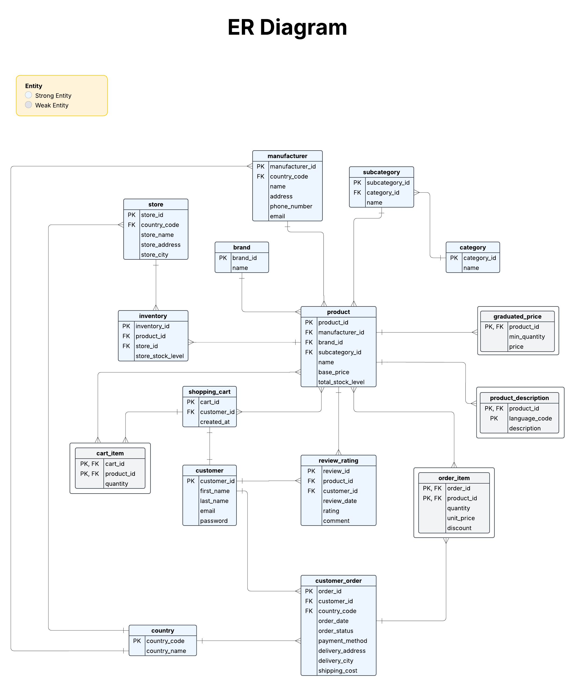

# E-commerce Online Store Germany - Database Schema

## **Project Description**

`An online store with several locations in Germany sells various products in a complex system of categories, subcategories, and brands. The product properties include name, price, description, stock level, graduated prices (depending on quantity), availability in individual stores, and assignment to a manufacturer with contact details (e.g., address, telephone number, email address). Customers can add products to the shopping cart, log in with an existing account, or order as a guest. Orders have a status (open, in progress, shipped, completed, canceled), a delivery address, and can be paid for using various payment methods (e.g., credit card, PayPal, prepayment). Each order can contain several items (lines), each containing a product, the quantity, and the price at the time of the order (possibly different from the regular price) as well as discounts and shipping costs.`

### **Additional Information:**

- `There is a table with country codes and country names.`

- `The product descriptions can be available in several languages.`

- `Customers can leave ratings and reviews for products.`

## **Entities and Attributes**

### **1. Product**
- `product_id` (PK)
- `manufacturer_id` (FK)
- `subcategory_id` (FK)
- `brand_id` (FK)
- `name`
- `base_price`
- `total_stock_level`

### **2. Product Description**
- `product_id` (PK, FK)
- `language_code` (PK)
- `description`

### **3. Brand**
- `brand_id` (PK)
- `name`

### **4. Category**
- `category_id` (PK)
- `name`

### **5. Subcategory**
- `subcategory_id` (PK)
- `category_id` (FK)
- `name`

### **6. Graduated Price**
- `product_id` (PK, FK)
- `min_quantity` (PK)
- `price`

### **7. Manufacturer**
- `manufacturer_id` (PK)
- `country_code` (FK)
- `name`
- `address`
- `phone_number`
- `email`

### **8. Inventory**
- `inventory_id` (PK)
- `product_id` (FK)
- `store_id` (FK)
- `store_stock_level`

### **9. Store**
- `store_id` (PK)
- `country_code` (FK)
- `store_name`
- `store_address`
- `store_city`

### **10. Customer**
- `customer_id` (PK)
- `first_name`
- `last_name`
- `email` (Unique)
- `password` (nullable for guests)

### **11. Customer Order**
- `order_id` (PK)
- `customer_id` (FK, nullable for guest orders)
- `country_code` (FK)
- `order_date`
- `order_status` (ENUM: open, in_progress, shipped, completed, canceled)
- `payment_method` (ENUM: credit_card, paypal, prepayment)
- `delivery_address`
- `delivery_city`
- `shipping_cost`

### **12. Order Item**
- `order_id` (PK, FK)
- `product_id` (PK, FK)
- `quantity`
- `unit_price`
- `discount`

### **13. Country**
- `country_code` (PK)
- `country_name`

### **14. Review Rating**
- `review_id` (PK)
- `product_id` (FK)
- `customer_id` (FK, nullable for anonymous)
- `review_date`
- `rating` (1-5)
- `comment`
- UNIQUE (`customer_id`, `product_id`) *(prevents multiple reviews per product per customer)*

### **15. Shopping Cart**
- `cart_id` (PK)
- `customer_id` (FK, nullable for guests)
- `created_at`

### **16. Cart Item**
- `cart_id` (PK, FK)
- `product_id` (PK, FK)
- `quantity`

## Relationships and Cardinalities

### 1. **Product (M) ↔ Manufacturer (1)**: Many-to-One
   - **Explanation**: Each product is assigned to one manufacturer, but a manufacturer can produce many products.
   - In the product table, `manufacturer_id` is a foreign key that links back to the manufacturer table.

### 2. **Product (M) ↔ Brand (1)**: Many-to-One
   - **Explanation**: Each product belongs to a single brand, but a brand can have many products.
   - In the product table, `brand_id` is a foreign key that links back to the brand table.

### 3. **Product (M) ↔ Subcategory (1)**: Many-to-One
   - **Explanation**: Each product is assigned to one subcategory, but a subcategory can have many products.
   - In the product table, `subcategory_id` is a foreign key that links back to the subcategory table.

### 4. **Subcategory (M) ↔ Category (1)**: Many-to-One
   - **Explanation**: Each subcategory belongs to one category, and a category can have many subcategories.
   - In the subcategory table, `category_id` is a foreign key that links back to the category table.

### 5. **Product (1) ↔ Inventory (M)**: One-to-Many
   - **Explanation**: Each product has separate stock entries per store. A product can have multiple inventory entries across various stores, but each inventory entry belongs to one product.
   - In the inventory table, `product_id` is a foreign key that links back to the product table.

### 6. **Inventory (M) ↔ Store (1)**: Many-to-One
   - **Explanation**: A store can have inventory for many products, but each inventory record refers to one store.
   - In the inventory table, `store_id` is a foreign key that links back to the store table.

### 7. **Product (1) ↔ Graduated Price (M)**: One-to-Many
   - **Explanation**: A product can have multiple graduated prices based on different quantity ranges, but each graduated price refers to one product.
   - In the graduated_price table, `product_id` is a foreign key that links back to the product table.

### 8. **Customer (1) ↔ Customer Order (M)**: One-to-Many
   - **Explanation**: One customer can place multiple orders, but each order belongs to one customer.
   - In the customer_order table, `customer_id` is a foreign key that links back to the customer table.

### 9. **Customer Order (1) ↔ Order Item (M)**: One-to-Many
   - **Explanation**: One order can have many order items, but each order item is part of only one order.
   - In the order_item table, `order_id` is a foreign key that links back to the customer_order table.

### 10. **Product (M) ↔ Order Item (M)**: Many-to-Many
   - **Explanation**: A product can be part of many orders, and an order can have many products.
   - In the order_item table, `product_id` is a foreign key that links back to the product table, and `order_id` links back to the order table.

### 11. **Manufacturer (M) ↔ Country (1)**: Many-to-One
   - **Explanation**: A country can have multiple manufacturers, but each manufacturer is linked to one country.
   - In the manufacturer table, `country_code` is a foreign key that links back to the country table.

### 12. **Store (M) ↔ Country (1)**: Many-to-One
   - **Explanation**: A country can have multiple stores, but each store is located in one country.
   - In the store table, `country_code` is a foreign key that links back to the country table.

### 13. **Customer Order (M) ↔ Country (1)**: Many-to-One
   - **Explanation**: A country can have multiple orders, but each order is linked to one country.
   - In the customer_order table, `country_code` is a foreign key that links back to the country table.

### 14. **Product (1) ↔ Product Description (M)**: One-to-Many
   - **Explanation**: One product can have many descriptions in different languages, but each description is linked to one product.
   - In the product_description table, `product_id` is a foreign key that links back to the product table.

### 15. **Product (1) ↔ Review Rating (M)**: One-to-Many
   - **Explanation**: One product can have many reviews, but each review belongs to one product.
   - In the review_rating table, `product_id` is a foreign key that links back to the product table.

### 16. **Customer (1) ↔ Review Rating (M)**: One-to-Many (Unique: customer_id, product_id)
   - **Explanation**: A customer can leave multiple reviews (one for each product), but the combination of `customer_id` and `product_id` should be unique, meaning a customer can only review a product once.
   - In the review_rating table, `customer_id` is a foreign key that links back to the customer table, and `product_id` is a foreign key that links back to the product table.

### 17. **Customer (1) ↔ Shopping Cart (1)**: One-to-One (nullable for guests)
   - **Explanation**: Each customer can have one shopping cart, and each shopping cart is associated with one customer. If a guest, the `customer_id` is nullable.
   - In the shopping_cart table, `customer_id` is a foreign key that links back to the customer table.

### 18. **Shopping Cart (1) ↔ Cart Item (M)**: One-to-Many
   - **Explanation**: One shopping cart can have many items, but each cart item belongs to one shopping cart.
   - In the cart_item table, `cart_id` is a foreign key that links back to the shopping_cart table.

### 19. **Product (M) ↔ Cart Item (M)**: Many-to-Many
   - **Explanation**: A product can be in many shopping carts, and a shopping cart can have many products.
   - In the cart_item table, `product_id` is a foreign key that links back to the product table, and `cart_id` links back to the shopping_cart table.

---

## **Summary of Relationships:**

### **One-to-Many (1:M) Relationships**
- `Product` → `Manufacturer`
- `Product` → `Brand`
- `Product` → `Subcategory`
- `Subcategory` → `Category`
- `Product` → `Inventory`
- `Inventory` → `Store`
- `Product` → `Graduated Price`
- `Customer` → `Customer Order`
- `Customer Order` → `Order Item`
- `Product` → `Product Description`
- `Product` → `Review Rating`
- `Customer` → `Review Rating`
- `Customer` → `Shopping Cart`
- `Shopping Cart` → `Cart Item`

### **Many-to-Many (M:M) Relationships**
- `Product` ↔ `Order Item`
- `Product` ↔ `Cart Item`

### **Many-to-One (M:1) Relationships**
- `Manufacturer` → `Country`
- `Store` → `Country`
- `Customer Order` → `Country`

### **One-to-One (1:1) Relationships**
- `Customer` → `Shopping Cart` *(nullable for guests)*

## **Key Features & Notes**

### **Guest Orders Supported**
- Guest users can place orders without an account (nullable `customer_id`).
- Guests must provide essential details (e.g., email, delivery address).

### **Review System**
- Customers can leave reviews anonymously (nullable `customer_id`).
- Unique constraint prevents duplicate reviews per product per customer.

### **Shopping Cart & Order Process**
- Guests and registered users can add multiple products to a cart before purchasing.
- `order_date` tracks order history.
- `order_status` and `payment_method` use ENUMs for efficiency.

### **Database Optimization**
- **Avoids duplication**: Composite keys in `order_item` and `cart_item` tables.
- **Standardized data**: ENUM fields ensure consistency.
- **Normalized structure**: `category` and `subcategory` ensure proper hierarchy.
- **Multi-language support**: `product_description` allows multiple language entries.

## **Database Schema Diagram**

---

### **Future Enhancements**
- Support for international shipping.
- Advanced discount and promotion system.
- AI-based product recommendations.
- Integration with multiple payment gateways.

This structured schema ensures a **scalable, efficient, and flexible** database design for an **E-commerce Online Store in Germany**. 

